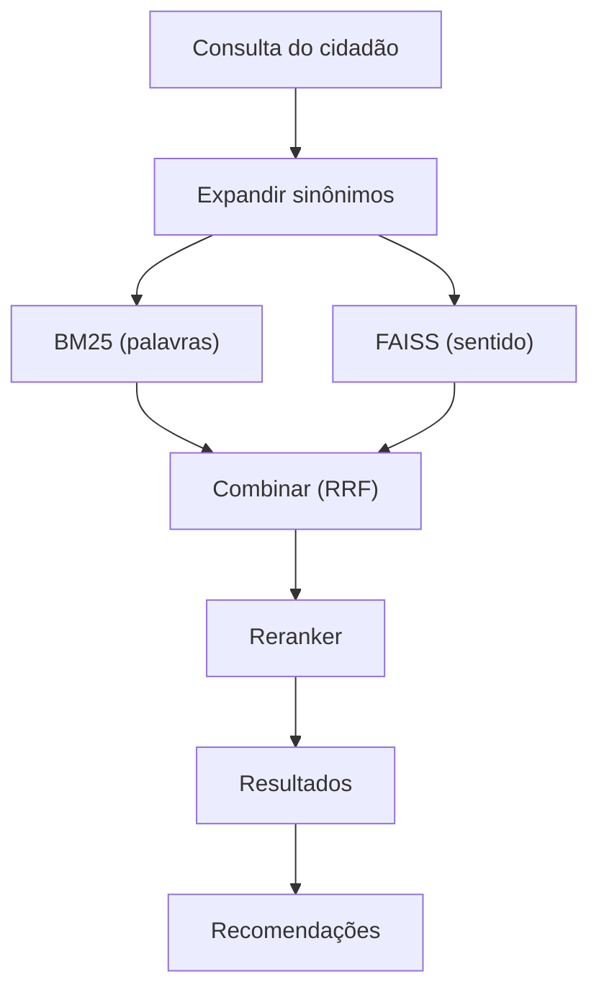

# facilita Rio

Motor de busca para serviços públicos. O cidadão descreve o que precisa em linguagem do dia a dia e o sistema encontra o serviço certo — mesmo sem nenhuma palavra em comum com o nome oficial.

## O Problema

Cidadãos não sabem o nome dos serviços. "Quero parar de fumar" precisa encontrar "Inscrição em Programa de Tratamento Antitabagismo". Uma busca por palavras-chave não resolve. E quando o sistema erra, o cidadão vai ao guichê errado e pode desistir do serviço.

Além de achar o serviço certo, o sistema sugere serviços relacionados. Uma gestante que busca "maternidade" talvez não saiba que precisa de kit enxoval, Bolsa Família e vacinação.

## Arquitetura



**Expansão de sinônimos.** Antes da busca, verifica a consulta contra padrões em `app/data/synonyms.json`. Se "febre" aparece, adiciona "hospital emergência upa". Esses padrões são específicos por catálogo — o sistema funciona sem eles, com menos precisão.

**BM25.** Busca por palavras. Encontra documentos que contêm os mesmos termos da consulta, com *stemming* (reduz palavras à raiz: "árvores" → "árvor"). Bom para termos exatos como "IPTU", ruim para linguagem coloquial.

**FAISS.** Busca por sentido. Um modelo de linguagem ([E5-small](https://huggingface.co/intfloat/multilingual-e5-small)) converte textos em vetores numéricos. Textos com significado parecido ficam próximos, mesmo sem compartilhar palavras. FAISS (Meta) compara esses vetores rapidamente.

**RRF.** Combina os rankings de BM25 e FAISS por posição (não por score bruto). FAISS recebe peso 2.0 e BM25 1.0 porque o semântico lida melhor com linguagem coloquial.

**Cross-Encoder.** Um segundo modelo ([mMARCO](https://huggingface.co/cross-encoder/mmarco-mMiniLMv2-L12-H384-v1)) que lê cada par (consulta, documento) integralmente. Mais preciso, mas lento (~63ms) — só processa os 20 melhores candidatos. Peso de 0.02 no score final (desempatador).

**Recomendações.** Sugere serviços relacionados usando vizinhança semântica, mesma categoria, clusters temáticos, e jornadas do cidadão (conexões manuais em `app/data/citizen_journeys.json`).

**Detecção fora-do-escopo.** Se a maior similaridade semântica (FAISS) fica abaixo de 0.83, sinaliza que a consulta pode estar fora do catálogo.

## Início Rápido

Requer **Python 3.11+**.

```bash
# Docker
docker compose up --build       # http://localhost:8000

# Ou local
pip install ".[test]"
python -c "import nltk; nltk.download('rslp')"   # stemmer português
uvicorn app.main:app --reload   # http://localhost:8000
```

Primeiro startup: ~30s (download de modelos). Depois: ~5s. Docs da API em `/docs`.

O catálogo fica em `servicos_selecionados.json`. Para usar outro, substitua esse arquivo — re-indexa no próximo startup.

**LLM (opcional):** Com `OPENAI_API_KEY`, usa GPT-4o-mini para enriquecer queries. Sem a chave, funciona normalmente.

```bash
pytest tests/ -v     # 72 testes, 96% cobertura
```

## Avaliação

```bash
python -m evaluation.evaluate          # suíte completa (~3 min)
python -m evaluation.check_regression  # gate CI: exit 0 = ok
```

Roda 8 análises: ablação (6 variantes), significância estatística (Fisher), recomendações, holdout (30 queries pós-tuning), 500 queries coloquiais, latência, análise de falhas, sweep do cross-encoder.

### Resultados

| Métrica | Valor |
|---------|-------|
| nDCG@5 (tuning / holdout) | 0.939 / 0.889 |
| MRR@10 | 0.985 |
| Top-3 accuracy (500 queries) | 100% |
| Latência p50 | ~74ms |

**nDCG@5** mede qualidade do ranking (resultado certo em #1 = score alto). **MRR@10** mede a posição do primeiro resultado correto. Gap tuning→holdout de 0.050 indica leve overfitting; nenhuma query do holdout tem MRR < 0.5.

### QRELs

Cada query de teste tem serviços anotados com grau 1–3 (marginal → perfeito). 83 queries de tuning (68 positivas + 15 negativas), 30 de holdout (25 + 5), 500 coloquiais (geradas por LLM — otimistas), 25 para recomendações. Anotador único — limitação reconhecida.

## Decisões

| Decisão | Evidência |
|---------|-----------|
| Busca híbrida | BM25: 0.80 → semântico: 0.90 → híbrido: 0.94. Significância confirmada (Fisher). |
| Semântico 2× | Lida melhor com linguagem coloquial. Validado por ablação. |
| Cross-encoder (peso 0.02) | Não significativo em nDCG@5 vs. híbrido sem CE (0.939 vs 0.937). Melhora MRR (0.985 vs 0.978). Mantido para escala futura. |
| Sem LLM ranqueador | $0.01–0.10/query, 500ms–2s. ROI negativo com nDCG em 0.94. |
| Threshold 0.83 | 0.82 detecta 53% negativas/0% FP; 0.83 detecta 80%/4.4% FP (alerta, não bloqueio). |

### Alternativas Consideradas

**Elasticsearch/OpenSearch:** Complexidade operacional sem benefício com 50 serviços. BM25+FAISS em memória atinge <100ms até 1000+.

**Embeddings fine-tuned:** Melhoraria PT-BR coloquial, mas requer pares rotulados que não temos. E5-small já atinge 0.90 nDCG.

**LLM como reranker:** GPT-4 poderia desambiguar, mas $0.01–0.10/query a 500ms–2s. Não justifica nesta escala.

**ColBERT:** Mais preciso para matching fino, mas ~10× armazenamento. Excessivo para 50 serviços.

## Escalabilidade (50 → 1200)

Latência medida com catálogos sintéticos:

| Serviços | p50 | Reranker | BM25 |
|----------|-----|----------|------|
| 50 | 72ms | 61ms | 0.14ms |
| 500 | 74ms | 62ms | 1.0ms |
| 1000 | 75ms | 63ms | 2.1ms |

Estável — o reranker sempre processa 20 candidatos.

**O que quebra:** A 200+, sinônimos manuais interferem → substituir por LLM. A 500+, E5-small confunde serviços parecidos → E5-base (768d). Threshold precisa recalibrar. CE se torna mais valioso (15–30%).

**Avaliação em escala:** Active learning para QRELs. Regressão por amostragem. 2–3 anotadores com concordância medida. Sinais implícitos (reformulação, cliques).

**Infraestrutura:** 50 → container único. 500+ → Redis cache, LLM para reescrita. 1200+ → FAISS aproximado ou banco vetorial.

### Plano Operacional

| O que muda | Quem | Cadência |
|-----------|------|----------|
| Catálogo | Equipe do portal | Contínua — atualiza JSON, sistema re-indexa no deploy |
| Sinônimos | Engenheiro de busca | Mensal → trimestral. A 500+ serviços, substituir por LLM |
| Jornadas | Analista + engenheiro | Trimestral. A 200+ serviços, minerar co-cliques |
| QRELs | 2–3 anotadores | A cada mudança grande. Active learning prioriza baixa confiança |

**Primeiras 4 semanas com 1200 serviços:**
1. Deploy genérico (sem sinônimos/jornadas). Baseline com 50 queries anotadas.
2. Instrumentar logs. Identificar 100 queries frequentes + 50 de baixa confiança.
3. Anotar QRELs para as 100 top. Criar sinônimos a partir de padrões de reformulação.
4. Avaliação formal. Baselines de nDCG/MRR. Regression gate. 5–10 jornadas de co-cliques.

## Limitações

- **Anotador único.** Não distingue erro do sistema de ambiguidade genuína.
- **500 queries coloquiais sintéticas** (LLM). O 100% top-3 é otimista.
- **Sinônimos e jornadas** específicos deste catálogo. Pipeline funciona sem eles.
- **Consultas genéricas** ("saúde pública") são genuinamente ambíguas — nDCG cai para 0.75.

## Estrutura

```
app/
├── main.py              # FastAPI, startup, cache LRU
├── config.py            # Parâmetros ajustáveis
├── models.py            # Service, SearchResult, SearchResponse
├── search/              # Pipeline, RRF, reranker, expansão de query
├── indexing/            # BM25, FAISS, clusters, loader
├── recommendation/      # Recomendações (semântica + jornadas)
├── routers/             # API JSON + páginas HTML
├── templates/           # Jinja2 + Tailwind CSS
├── data/                # synonyms.json, citizen_journeys.json (opcionais)
└── observability/       # structlog + Prometheus
evaluation/              # Ablação, holdout, falhas, latência, sweep CE
tests/                   # 72 testes (pytest + Hypothesis)
```
