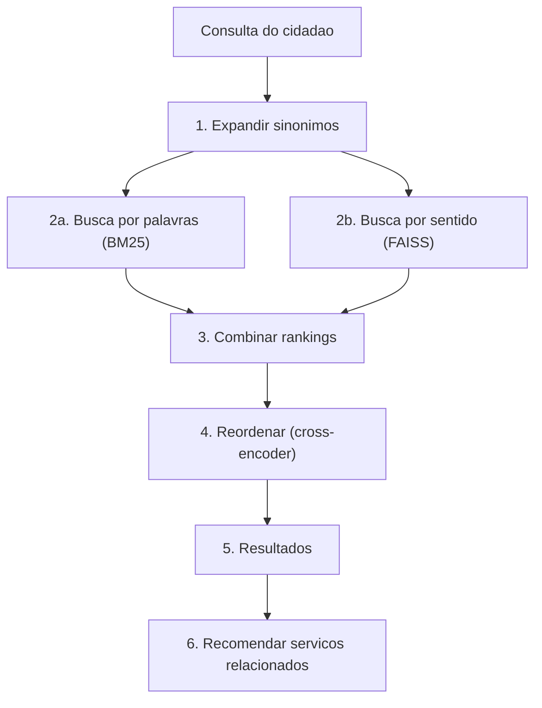

# facilita Rio

https://facilita-rio.com

Motor de busca que ajuda cidadaos a encontrar servicos publicos usando linguagem do dia a dia.

## O problema

Cidadaos nao sabem o nome oficial dos servicos. Alguem que digita "quero parar de fumar" precisa encontrar "Inscricao em Programa de Tratamento Antitabagismo" — mas nenhuma palavra e igual. Busca por palavras-chave nao funciona aqui.

Quando o sistema erra, a pessoa vai ao guiche errado, perde um dia de trabalho e pode desistir de um beneficio a que tem direito. Busca que entende linguagem coloquial e questao de acesso.

## Como funciona



O pipeline tem 6 etapas. Cada uma resolve um pedaco do problema:

**1. Expandir sinonimos.** Antes de buscar, o sistema procura padroes na consulta. "Febre" vira "febre hospital emergencia UPA". Esses padroes ficam em `app/data/synonyms.json` — sao opcionais e especificos do catalogo.

**2a. Busca por palavras (BM25).** BM25 (Best Match 25) e o algoritmo classico de busca por palavras: pontua documentos que contem as mesmas palavras da consulta. Usa *stemming* em portugues — "arvores" e "arvore" sao tratados como a mesma palavra. Funciona bem para termos exatos como "IPTU", mas falha quando o cidadao usa linguagem diferente do cadastro.

**2b. Busca por sentido (FAISS + embeddings).** Um modelo de IA transforma textos em *embeddings* — listas de numeros que representam o significado. Textos com significado parecido geram embeddings proximos, mesmo sem compartilhar palavras. FAISS (biblioteca da Meta para busca vetorial) compara esses embeddings rapidamente. E assim que "quero parar de fumar" encontra "tratamento antitabagismo". O modelo usado e o [E5-small](https://huggingface.co/intfloat/multilingual-e5-small) (multilingual, 384 dimensoes).

**3. Combinar rankings (RRF).** As duas buscas produzem rankings diferentes. RRF (Reciprocal Rank Fusion) combina por posicao: cada resultado recebe `1/(60 + posicao)` pontos de cada busca, ponderados por peso. Se um servico aparece em 1o na busca por sentido e 5o na busca por palavras, recebe um score alto. A busca por sentido tem peso 2x (consultas coloquiais sao o caso mais comum).

**4. Reordenar (cross-encoder).** Um *cross-encoder* e um modelo de IA que le a consulta e o documento juntos (nao separados como na busca vetorial). O modelo [mMARCO](https://huggingface.co/cross-encoder/mmarco-mMiniLMv2-L12-H384-v1) le cada par (consulta, servico) inteiro. E mais preciso, mas mais lento (~80ms). Processa apenas os 20 melhores candidatos.

**5. Resultados.** Os servicos mais relevantes, ordenados pelo score final.

**6. Recomendacoes.** Sugere servicos relacionados combinando: proximidade semantica, mesma categoria, agrupamentos tematicos e "jornadas do cidadao" — conexoes manuais entre servicos que costumam ser necessarios juntos (exemplo: maternidade -> kit enxoval -> Bolsa Familia).

## Inicio rapido

Requer **Python 3.11+**.

### Opcao 1: Docker (recomendado)

```bash
docker compose up --build
# Abra http://localhost:8000
```

### Opcao 2: Instalacao local

```bash
pip install ".[test]"
python -c "import nltk; nltk.download('rslp')"
uvicorn app.main:app --reload
# Abra http://localhost:8000
```

O primeiro startup demora ~30s (download de modelos de IA). Depois, ~5s.

### O que voce vai ver

- **http://localhost:8000** — Interface de busca
- **http://localhost:8000/docs** — Documentacao interativa da API
- **http://localhost:8000/health** — Status do sistema

Experimente: "meu cachorro esta doente", "preciso de emprego", "quero parar de fumar".

### Usando outro catalogo

O catalogo fica em `servicos_selecionados.json`. Substitua por outro com a mesma estrutura e reinicie. Os arquivos em `app/data/` (sinonimos e jornadas) sao opcionais — o sistema funciona sem eles.

### LLM (opcional)

```
OPENAI_API_KEY=sk-...   # Ativa enriquecimento de query via LLM
```

Sem essa chave, o sistema funciona normalmente.

## Testes

```bash
pytest tests/ -v            # 72 testes, 96% de cobertura
ruff check app/ evaluation/ # lint
```

## Avaliacao de qualidade

A avaliacao mede se o sistema retorna bons resultados. Temos consultas de teste com respostas corretas anotadas, e metricas que calculam quao bom e o ranking.

### Rodando

```bash
python -m evaluation.evaluate          # suite completa (~3 min)
python -m evaluation.check_regression  # verifica se nada piorou (CI)
```

### Metricas principais

| Metrica | O que mede | Valor |
|---------|-----------|-------|
| nDCG@5 (Normalized Discounted Cumulative Gain) | Os 5 primeiros resultados estao na ordem certa? (1.0 = perfeito) | 0.964 |
| MRR@10 (Mean Reciprocal Rank) | O resultado correto aparece em que posicao? (1.0 = sempre em #1) | 1.000 |
| Holdout nDCG@5 | Mesmo, em 25 consultas nao vistas durante o desenvolvimento | 0.898 |
| Holdout MRR@10 | Posicao do primeiro correto em consultas nao vistas | 0.960 |
| Latencia p50 | Tempo mediano de resposta | ~91ms |

**Sobre o holdout:** A diferenca de 0.066 entre o nDCG do conjunto principal (0.964) e do holdout (0.898) indica algum overfitting — as 147 consultas do conjunto principal foram construidas durante o desenvolvimento. O holdout e mais representativo da performance real.

### O que a avaliacao faz (8 analises)

- **Ablacao** — remove um componente de cada vez para provar que cada um melhora o resultado
- **Holdout** — 30 consultas criadas *depois* de todo tuning
- **Significancia estatistica** — teste de Fisher para confirmar que as diferencas nao sao acaso
- **Analise de falhas** — classifica *por que* cada erro acontece
- **Recomendacoes** — mede precisao das sugestoes de servicos relacionados
- **Latencia** — benchmark por componente
- **Sweep do cross-encoder** — testa pesos de 0% a 30%
- **Sweep do peso semantico** — testa pesos de 0.5x a 3.0x
- **500 queries coloquiais** — consultas informais geradas por LLM

### Dados de avaliacao

| Arquivo | Conteudo |
|---------|---------|
| `evaluation/test_queries.json` | 147 consultas de teste com respostas anotadas |
| `evaluation/holdout_queries.json` | 30 consultas de validacao (nunca vistas no desenvolvimento) |
| `evaluation/rec_queries.json` | 25 consultas para testar recomendacoes |
| `evaluation/queries_populares.json` | 500 consultas coloquiais |

Esses dados sao especificos do catalogo atual. Para outro catalogo, crie novas consultas.

## Decisoes tecnicas

Cada decisao tem um numero que a justifica:

| Decisao | Justificativa |
|---------|--------------|
| Busca hibrida (BM25 + semantico) | BM25 sozinho = 0.81, semantico sozinho = 0.91, juntos = 0.96. Confirmado por teste estatistico. |
| Semantico com peso 2x | Sweep testou 0.5x-3.0x. Pesos 1.5x e 2.0x sao equivalentes (0.9634 vs 0.9625 no principal, 0.8977 vs 0.8979 no holdout). 2.0x favorece linguagem coloquial. |
| Cross-encoder com peso 8% | Melhora MRR de 0.996 para 1.000. Sweep testou 0%-30%. |
| Sem LLM para reranking | Custaria $0.01-0.10/busca e adicionaria 500ms-2s. Com nDCG em 0.96, nao justifica. |
| Threshold de confianca 0.83 | Detecta 68% das consultas fora-do-escopo com 6.2% de falsos positivos. |

### Alternativas descartadas

- **Elasticsearch**: complexidade desnecessaria para 50 servicos. BM25+FAISS em memoria responde em <100ms.
- **Fine-tuning de embeddings**: precisa de pares (consulta, servico correto) que nao temos.
- **LLM como reranker**: mais preciso, mas caro e lento demais para esta escala.
- **ColBERT**: mais preciso para matching fino, mas muito mais complexo operacionalmente para 50 servicos.

## Escalabilidade (50 -> 1200 servicos)

### Latencia

Testada com catalogos sinteticos:

| Servicos | Tempo medio | Gargalo |
|----------|------------|---------|
| 50 | 72ms | Reranker (61ms) |
| 500 | 74ms | Reranker (62ms) |
| 1000 | 75ms | Reranker (63ms) |

A latencia nao cresce porque o reranker sempre processa 20 candidatos, nao o catalogo inteiro.

### Memoria

~12MB para 1200 servicos. Cabe em qualquer servidor.

### O que muda com mais servicos

| Escala | O que quebra | Solucao |
|--------|-------------|---------|
| 200+ | Sinonimos manuais nao cobrem tudo | Substituir por LLM para expansao automatica |
| 500+ | Mais servicos com nomes parecidos — cross-encoder precisa discriminar melhor | Aumentar peso do CE (sweep mostra que com mais candidatos similares, CE ganha importancia) |
| 500+ | Threshold de confianca precisa recalibrar | Com mais servicos, scores sobem — recalibrar |
| 1200+ | Recall@20 pode cair para ~85-90% | Aumentar candidatos para top-40 (+20ms de reranker) |
| 1200+ | **Avaliacao** e o gargalo real | Instrumentar logs de clique/reformulacao para feedback implicito |

### Plano operacional

| O que muda | Quem faz | Quando |
|-----------|---------|--------|
| Catalogo de servicos | Equipe do portal | Continua — atualiza JSON, re-indexa no deploy |
| Sinonimos | Engenheiro de busca | Mensal. A partir de 500 servicos, substituir por LLM |
| Jornadas do cidadao | Analista + engenheiro | Trimestral. A partir de 200 servicos, minerar padroes de uso |
| Consultas de teste | 2-3 anotadores | A cada mudanca grande |

**Primeiras 4 semanas com 1200 servicos:**
1. Deploy sem sinonimos/jornadas. Baseline com 50 consultas anotadas.
2. Instrumentar logs. Identificar 100 consultas mais frequentes.
3. Anotar respostas corretas. Criar sinonimos a partir de padroes de reformulacao.
4. Avaliacao formal. Baselines de nDCG/MRR. Regression gate no CI.

## Limitacoes

- **Anotador unico.** Consultas anotadas por uma pessoa. Inter-rater agreement fortaleceria a avaliacao.
- **Overfitting ao conjunto de tuning.** Holdout mostra nDCG 0.898 vs 0.964 — parte da performance reflete ajuste ao conjunto de desenvolvimento.
- **500 queries coloquiais sao sinteticas** (geradas por LLM). O 99.6% de acerto e otimista.
- **Recomendacoes.** Nas consultas de teste dedicadas, 81% dos servicos esperados aparecem nos resultados de busca, nao na secao de recomendacoes. A contribuicao genuina das recomendacoes e ~19%.
- **Sinonimos e jornadas** sao especificos deste catalogo. O pipeline funciona sem eles.
- **Consultas genericas** ("saude") sao genuinamente ambiguas — nDCG cai porque varios servicos sao igualmente validos.

## Estrutura do projeto

```
app/
  main.py              # FastAPI: startup, cache, rotas
  config.py            # Todos os parametros num unico lugar
  models.py            # Tipos de dados
  search/              # Pipeline, fusao RRF, reranker, expansao de query
  indexing/             # BM25, FAISS, clusters, carregador do catalogo
  recommendation/      # Motor de recomendacoes
  routers/             # Endpoints da API e paginas web
  templates/           # Interface web (Jinja2 + Tailwind)
  data/                # Sinonimos e jornadas (opcionais)
  observability/       # Logging estruturado + metricas Prometheus
evaluation/            # Suite de avaliacao
tests/                 # 72 testes (pytest + Hypothesis)
```
