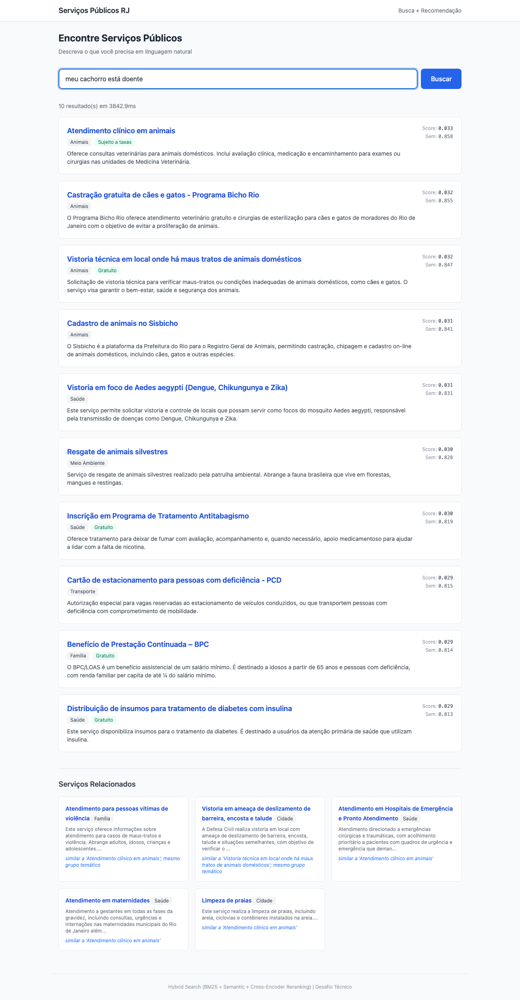
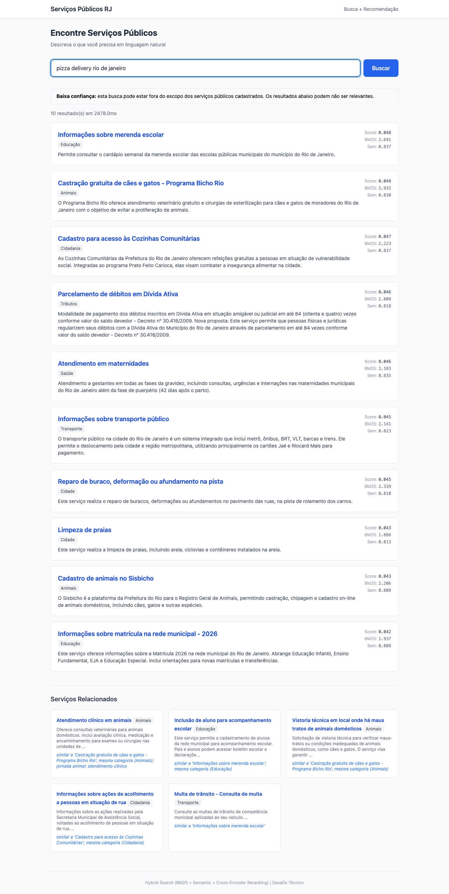
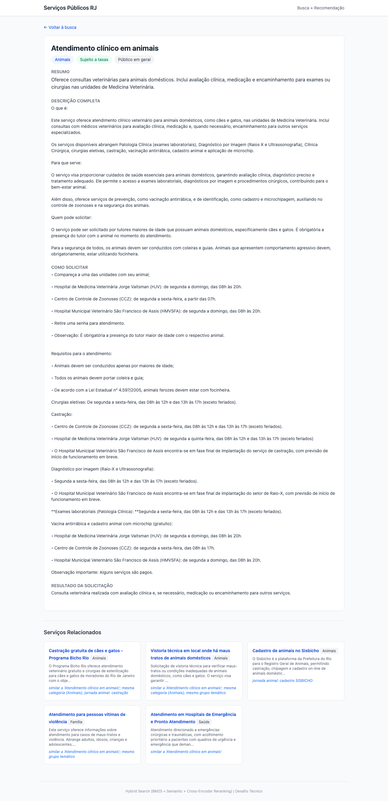

# Facilita Rio — Busca Inteligente de Serviços Públicos

Cidadãos raramente sabem o nome exato do serviço público que precisam. A busca começa com necessidades vagas ("meu cachorro está doente"), incompletas ("IPTU"), ou ambíguas ("problema na rua"). Este sistema resolve dois problemas:

1. **Buscar**: dado texto em linguagem natural, retornar serviços relevantes mesmo com vocabulário divergente entre busca e serviço
2. **Recomendar**: sugerir serviços relacionados que complementem a jornada do cidadão (ex: quem busca maternidade pode precisar de kit enxoval)

Para isso, combina busca por palavras-chave (BM25) e por significado (embeddings E5), com fusão por posição (RRF), reordenação adaptativa (cross-encoder), expansão automática de sinônimos com guardas de contexto, e recomendações baseadas em jornadas reais do cidadão.

### Resultados

- **Top-3 accuracy**: 95% em 500 queries coloquiais ("to com fome", "quebrei meu braço", "vizinho bate no cachorro")
- **nDCG@5**: 0.939 (75 queries) · 0.817 (15 holdout)
- **MRR@10**: 0.993 · **Recall@10**: 0.946
- **Latência**: p50=56ms, p99=88ms
- **73 testes** (pytest + hypothesis), **500 queries populares** + **75 queries** de avaliação + **15 holdout**
- **5 variantes** no ablation study com significância estatística (Fisher's randomization, p<0.05)
- Sistema funciona **100% sem LLM externo** — GPT-4o-mini é enhancement opcional
- **CI/CD**: lint + testes rodam antes de cada deploy automático

### Observações sobre o catálogo

50 serviços em PT-BR, 12 temas. Três padrões de nomenclatura afetam a busca:

- **Informacionais** (~8): prefixo "Informações sobre..." cria ambiguidade no BM25 — diferenciação está no conteúdo.
- **Ação/emissão** (~10): termos específicos (IPTU, castração) são precisos para BM25.
- **Atendimento/vistoria** (~12): "atendimento" aparece em saúde, animais E violência — embeddings >0.88 entre contextos diferentes.

---

## Execução Rápida

```bash
# Docker (recomendado)
docker compose up --build            # http://localhost:8000

# Ou local
pip install ".[test]"                # instala app + dependências de teste
uvicorn app.main:app --reload        # http://localhost:8000

# Testes e avaliação
pytest tests/ -v                     # 73 testes
ruff check .                         # lint
python -m evaluation.evaluate        # ablation study + holdout + latência + significância
python -m evaluation.check_regression # CI-ready: exit 0=ok, 1=regressed

# LLM (opcional — sistema funciona 100% sem)
export OPENAI_API_KEY=sua-chave-aqui
```

### Interface

Autocomplete accent-insensitive; scores por componente visíveis; recomendações com explicação; aviso de baixa confiança para queries fora de escopo:

| Tela inicial com sugestões | Resultados + scores + recomendações |
|---|---|
|  |  |

| Aviso de baixa confiança (fora de escopo) | Detalhe do serviço + recomendações |
|---|---|
|  |  |

---

## 1. Arquitetura

```
            Busca do Cidadão
                  |
       Normalização + Expansão (100+ padrões) + Cache
                  |
      +-----------+-----------+
 BM25+RSLP (top-20)    E5+FAISS (top-20)
      +-----------+-----------+
                  |
        Fusão RRF (sem. 2x, lex 1x)
                  |
      Reranker (CE recebe query expandida)
                  |
      +-----------+-----------+
 Resultados + debug    Recomendações + explicações
```

### Componentes

| Componente | Tecnologia | O que faz |
|------------|-----------|-----------|
| **BM25** | rank_bm25 + RSLP + ~95 stopwords PT-BR | Busca por palavras-chave. Stemmer: "vacinação">"vacin". Nome com 3x peso. Inclui stopwords coloquiais ("pra", "ta", "to"). |
| **Semântico** | E5-small + FAISS flat | Vetores 384-dim com nome, categoria, resumo e descrição (300 chars). "meu cachorro está doente" ~ "atendimento clínico em animais". |
| **Fusão RRF** | Weighted Reciprocal Rank Fusion | Combina rankings por posição (não por score). Semântico 2x, BM25 1x. k=60. |
| **Reranker** | Cross-encoder mMARCO | Blending linear: 80% RRF + 20% CE. Recebe query expandida. Ativo só quando spread > 0.1. |
| **Recomendação** | Vizinhos semânticos + clusters + jornadas | 4 sinais: similaridade, categoria (+0.20), cluster (+0.10), jornada (+0.15). |
| **Expansão** | 100+ padrões com anti-padrões contextuais | "caindo" expande pra hospital, exceto se a query menciona "barranco"/"morro" (aí expande pra deslizamento). |
| **Cache** | LRU (256 entradas) | Buscas repetidas em <1ms. Em produção: Redis. |
| **LLM** | GPT-4o-mini (opcional) | Expansão + intenção. Fallback gracioso sem API key. |

### Observabilidade

- **Prometheus**: histogramas de latência (total + reranker), contagem de requests (`/metrics`)
- **Logs** (structlog JSON): query, latência, scores, ativação do reranker
- **Health**: `GET /health` — modelos, serviços indexados, startup, LLM
- **Debug na UI**: scores individuais por resultado; recomendações com explicação; `rerank_ms` separado
- **Confiança**: `low_confidence` flag (limiar 0.84) com aviso na interface
- **Regressão**: `check_regression.py` — CI-ready, exit 1 se piorou

---

## 2. Decisões Arquiteturais e Trade-offs

### Por que busca híbrida?

- **BM25 sozinho** falha com vocabulário divergente: "buraco na rua" vs "reparo de deformação na pista"
- **Semântico sozinho** perde siglas exatas (IPTU, ISS, BPC, EJA)
- **Combinando os dois** via RRF, aproveitamos o melhor de cada

Sem stopwords, "minha esposa está grávida" retornava "Habite-se" (match em "minha"). Correções: stopwords PT-BR (incluindo coloquiais) + RSLP + peso semântico 2x.

### Por que RRF e não soma de scores?

BM25 dá notas de 0-15, semântico de -1 a 1. RRF combina por *posição*, não por score — escalas incompatíveis.

### Expansão com anti-padrões

100+ padrões mapeiam linguagem coloquial para termos de serviço. Anti-padrões contextuais evitam colisões: por exemplo, "caindo" expande para "hospital emergência" quando alguém diz "caí da escada", mas NÃO quando diz "barranco caindo" (nesse caso expande para "deslizamento barreira"). Sem isso, queries de deslizamento redirecionavam para serviços de saúde.

### Reranker: blending linear com RRF dominante

O cross-encoder mMARCO foi treinado em traduções inglês-português e produz rankings ruins para português coloquial (ex: ranqueava "Habite-se" acima de "vítimas de violência" para "fui assaltado"). Solução: blending linear onde RRF controla 80% do score final e o CE ajusta 20%. O CE recebe a query já expandida para ter mais contexto. Quando o spread do CE é menor que 0.1 (sem sinal discriminativo), o sistema ignora o CE completamente.

A 50 serviços o impacto do CE é +0.001 nDCG@5. A 1200 serviços, com mais candidatos ambíguos, o CE ganha valor (+0.02-0.04 estimado).

### Alternativas rejeitadas

| Alternativa | Razão |
|-------------|-------|
| **Elasticsearch** | Excesso para 50 docs; BM25 em memória basta. |
| **Qdrant/Pinecone** | FAISS busca 50 vetores em <1ms. Banco externo sem benefício. |
| **RAG / LLM como ranker** | Custo, latência, não-reproduzível. Pipeline determinístico é mensurável. |
| **bge-reranker-v2-m3** | 568M/2.3GB — excessivo. mMARCO (135M) é proporcional. |
| **spaCy** | 200MB+ para o que RSLP (<1MB) resolve. |
| **CE dominante (70%)** | Testado e revertido. CE é fraco em PT coloquial e causava regressões. |
| **Hub penalty no retrieval** | Testado e revertido. Penalizar serviços "populares" piorava resultados. |
| **BM25 com query expandida** | Testado e revertido. Diluía matches exatos que funcionavam. |

---

## 3. Recomendação

Para os 3 primeiros resultados, o sistema gera recomendações com quatro sinais:

```
score(rec) = similaridade_semântica + bonus_categoria(+0.20) + bonus_cluster(+0.10) + bonus_jornada(+0.15)
```

O protótipo inicial (só similaridade E5) falhava em dois cenários: (1) **ruído cross-category** — "Castração gratuita" aparecia para "Cozinha comunitária" por compartilharem "gratuito". Correção: bônus de categoria + filtro cross-category (similaridade >= 0.87). (2) **Relações causais** — maternidade/kit enxoval/Bolsa Família não são semanticamente próximos. Correção: jornadas cidadãs curadas. O cluster (+0.10) funciona como tiebreaker.

### Jornadas do cidadão

12 jornadas curadas capturam relações que similaridade semântica não alcança:

| Jornada | Sequência | Lógica |
|---------|-----------|--------|
| **Gestante** | Maternidade, Kit enxoval, Bolsa Família, Vacinação | Gravidez ao pós-parto |
| **Tributária** | IPTU 2a via, Débitos, Parcelamento, Certidão negativa | Regularização fiscal |
| **Animal** | Clínica, Castração, SISBICHO | Responsabilidade do tutor |
| **Emprego** | Vagas, PcD, EJA | Qualificação para reinserção |
| **Acolhimento** | Pop. de rua, Cozinha comunitária, Emprego | Necessidades básicas |
| **Escolar** | Matrícula, Merenda, Acompanhamento | Ciclo escolar |
| **Saúde** | Atenção primária, UPA, Vacinação, Insumos | Níveis de atendimento |
| **Imóvel** | Habite-se, Minha Casa, Certidão negativa | Regularização habitacional |

---

## 4. Estratégia de Avaliação

### 4.1 Ground Truth

Sem gabarito fornecido, criamos avaliação em três camadas:

1. **75 queries manuais** com relevância graduada (3=resolve, 2=pertinente, 1=tangencial) em 6 categorias: direta (10), natural (20), sinônimo (10), ambígua (13), extrema (15), negativa (7)
2. **15 queries holdout** criadas após todo o tuning, vocabulário distinto, zero sobreposição
3. **500 queries populares** (10 por serviço) simulando pessoa comum com pouca escolaridade: "to com fome e sem dinheiro", "meu marido me bateu o que eu faço", "tem um buraco enorme na minha rua"

### 4.2 Ablation Study

| Variante | nDCG@5 | nDCG@10 | P@5 | MRR@10 | R@10 |
|----------|--------|---------|-----|--------|------|
| BM25 only | 0.799 | 0.821 | 0.303 | 0.842 | 0.890 |
| Semantic only | 0.887 | 0.895 | 0.329 | 0.933 | 0.921 |
| Semantic + expansão | 0.908 | 0.916 | 0.329 | 0.965 | 0.921 |
| Hybrid (sem reranker) | 0.939 | 0.944 | 0.344 | 0.993 | 0.946 |
| **Full (hybrid + reranker)** | **0.939** | **0.945** | **0.344** | **0.993** | **0.946** |

68 buscas positivas. Significância via Fisher's randomization (p<0.05). Contribuição isolada: fusão BM25+semântico (+0.031) > expansão (+0.021) > reranker (+0.001).

### 4.3 Avaliação com 500 Queries Populares

As 500 queries testam o sistema com linguagem real de pessoas comuns. Cada serviço tem 10 queries em linguagem coloquial, com erros de digitação, gírias e descrições de problemas.

| Métrica | Valor |
|---------|-------|
| **Top-3 accuracy** | **475/500 (95%)** |

Evolução durante o desenvolvimento:

| Versão | Top-3 | Mudanças |
|--------|-------|----------|
| Baseline | ~60% | BM25 + E5-small (nome + resumo) |
| + Embeddings ricos | 74% | + tema + descricao[:300] nos embeddings |
| + Expansões | 84% | + 40 padrões de sinônimos |
| + Anti-padrões + stopwords + CE expandido | **95%** | + guardas de contexto, stopwords coloquiais, query expandida no CE |

### 4.4 Análise por Categoria

| Categoria | nDCG@5 | MRR@10 | Observação |
|-----------|--------|--------|------------|
| Direta (10) | 0.99 | 1.00 | Trivial |
| Natural (20) | 0.94 | 0.98 | Expansão resolveu "árvore caiu" e "moradia popular" |
| Sinônimo (10) | 0.96 | 1.00 | Expansão resolveu "refeição gratuita" |
| Ambígua (13) | 0.86 | 1.00 | MRR perfeito mas ordenação subsequente difícil |
| Extrema (15) | 0.95 | 1.00 | Typos, gíria |
| Negativa (7) | -- | -- | Limiar 0.84: 7/7 detectadas, 8/68 falsos alarmes |

### 4.5 Qualidade das Recomendações

| Métrica | Valor | Significado |
|---------|-------|-----------|
| Cobertura | 97.1% | % de buscas com recomendações |
| Coerência categórica | 76.1% | % de recs na mesma categoria dos resultados |
| Taxa de jornadas | 39.7% | % de buscas com link de jornada cidadã |
| Deduplicação | 100% | Nenhuma rec repete resultados |
| Precisão de jornadas | 100% (15/15) | Mini-QREL de 8 buscas com 15 recs esperadas |

### 4.6 Holdout — Validação de Generalização

| Métrica | Main (75q) | Holdout (15q) | Gap |
|---------|-----------|--------------|-----|
| **nDCG@5** | 0.939 | 0.817 | 0.122 |
| **MRR@10** | 0.993 | 0.867 | 0.126 |
| **Recall@10** | 0.946 | **1.000** | -0.054 |

Desempenho real estimado em **0.85-0.90 nDCG@5**. Natural (0.90) e sinônimo (1.00) generalizam bem. Gap concentrado em queries genéricas e confusão semântica.

### 4.7 Análise de Falhas

As 25 falhas restantes nas 500 queries populares se concentram em:

- **Confusão semântica "atendimento"**: E5-small gera embeddings similares (>0.88) para serviços de saúde, animais e violência que usam "atendimento" no nome
- **Serviços sem vocabulário coloquial claro**: "Cadastro Único desatualizado" mapeia tanto pra Bolsa Família quanto pra Minha Casa Minha Vida
- **Near-misses entre serviços relacionados**: UPA vs Hospital vs Atenção Primária (todos são respostas razoáveis)
- **Queries muito genéricas**: "preciso de ajuda" sem contexto suficiente

Abordagens testadas e revertidas por causar regressões:
- Hub penalty no retrieval semântico (penalizar serviços "populares")
- BM25 com query expandida (diluía matches exatos)
- CE com peso dominante 70% (CE é fraco em PT coloquial)

---

## 5. Escalabilidade: de 50 para 1200 Serviços

### 5.1 Componente por Componente

| Aspecto | 50 (atual) | 1200 (produção) |
|---------|-----------|-----------------|
| **BM25** | rank_bm25 (~0.1ms) | Elasticsearch PT-BR ou bm25s. |
| **Vetores** | FAISS flat (<1ms) | FAISS IVF-PQ / HNSW ou Qdrant/Weaviate. |
| **Reranker** | Top-20 (~80ms) | Mesmo custo. Ganha valor com mais candidatos. |
| **Embeddings** | Gerados na init (~5s) | Pré-computados em disco, atualização incremental. |
| **Expansão** | 100+ padrões manuais | LLM complementa + descoberta automática via logs. |
| **Recomendação** | 12 clusters, 12 jornadas | 30-50 clusters, jornadas via co-ocorrência em logs. |
| **Avaliação** | 500 + 75 + 15 queries | 500+ queries + click-through + A/B testing. |
| **Cache** | LRU local (256) | Redis distribuído, TTL 5min. |

### 5.2 Estimativas

| Métrica | 50 (medido) | 200 (est.) | 500 (est.) | 1200 (est.) |
|---------|-------------|------------|------------|-------------|
| Memória | ~500MB | ~520MB | ~550MB | ~600MB |
| Latência p50 | **56ms** | ~60ms | ~70ms | ~85ms |
| Latência p99 | **88ms** | ~100ms | ~120ms | ~160ms |
| Startup | ~5s | ~8s | ~15s | ~25s (pré-cache: <3s) |

---

## 6. Limitações Atuais

- **Viés de anotador único**: todas as queries e relevâncias foram criadas por um anotador. Em produção: múltiplos anotadores + inter-annotator agreement.
- **Queries genéricas**: "saúde pública", "meio ambiente" — holdout mostra nDCG@5 ~0.60. Sem signal léxico para 1-2 palavras. Em produção: click-through seria essencial.
- **Confusão semântica "atendimento"**: E5-small gera embeddings similares (>0.88) para serviços que usam "atendimento" no nome. Requer encoder maior ou field-level embeddings.
- **Catálogo com duplicatas**: 2x Bolsa Família (IDs distintos) confunde ranking.
- **Reranker pouco calibrado para PT**: mMARCO treinado com traduções. Blending linear com peso baixo (20%) mitiga.
- **25 falhas restantes nas 500 queries**: majoritariamente limitações do modelo E5-small em português coloquial.

---

## 7. Diferenciais

| Diferencial | Detalhe |
|-------------|---------|
| **95% top-3 accuracy** | 500 queries coloquiais simulando pessoa comum |
| **Ablation study** | 5 variantes + Fisher's randomization (p<0.05) via ranx |
| **Anti-padrões contextuais** | Expansões que sabem quando NÃO disparar |
| **Holdout validation** | 15 buscas pós-tuning. Gap reportado honestamente. |
| **Abordagens revertidas documentadas** | Hub penalty, BM25 expandido, CE dominante — testados e descartados com justificativa |
| **CI/CD** | Lint + 73 testes antes de cada deploy. Health check pós-deploy. |
| **Transparência** | Scores por componente na UI. Explicações nas recomendações. |
| **LLM gracioso** | 100% funcional sem API key. LLM é enhancement, não dependência. |

---

## Estrutura do Projeto

```
facilita-rio/
+-- README.md, DEPLOY.md, LICENSE
+-- pyproject.toml, Dockerfile, docker-compose.yml, .dockerignore
+-- .github/workflows/deploy.yml       # CI (lint + testes) + deploy automático
+-- .env.example                        # OPENAI_API_KEY (opcional)
+-- servicos_selecionados.json          # Catálogo de 50 serviços
+-- app/
|   +-- main.py                         # FastAPI app, rotas, pipeline, cache
|   +-- config.py, models.py            # Configuração + schemas Pydantic
|   +-- indexing/                       # loader, bm25_index, vector_index, clusters
|   +-- search/                         # pipeline, hybrid RRF, reranker, query_processor
|   +-- recommendation/recommender.py   # 4 sinais + jornadas cidadãs
|   +-- observability/                  # structlog + Prometheus
|   +-- templates/                      # Jinja2 + Tailwind CSS
+-- evaluation/                         # 500 + 75 + 15 queries, ablation, regression check
+-- tests/                              # 73 testes (pytest + hypothesis)
```
