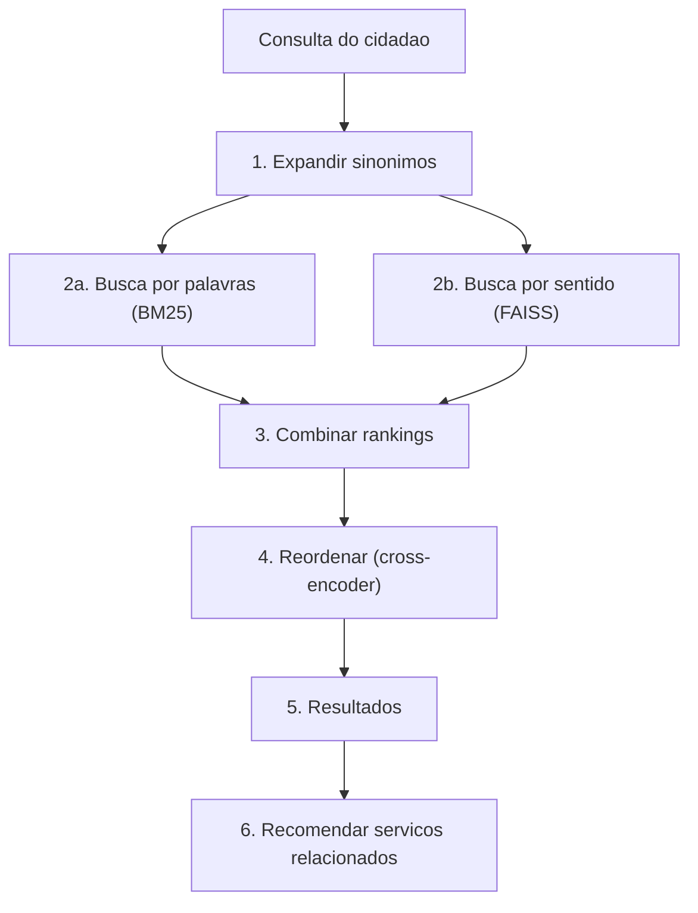

# facilita Rio

https://facilita-rio.com

Motor de busca que ajuda cidadãos a encontrar serviços públicos usando linguagem do dia a dia.

## O problema

Cidadãos não sabem o nome oficial dos serviços. Alguém que digita "quero parar de fumar" precisa encontrar "Inscrição em Programa de Tratamento Antitabagismo" — mas nenhuma palavra é igual. Busca por palavras-chave não funciona aqui.

Quando o sistema erra, a pessoa vai ao guichê errado, perde um dia de trabalho e pode desistir de um benefício a que tem direito. Busca que entende linguagem coloquial é questão de acesso.

## Como funciona



O pipeline tem 6 etapas. Cada uma resolve um pedaço do problema:

**1. Expandir sinônimos.** Antes de buscar, o sistema procura padrões na consulta. "Febre" vira "febre hospital emergência UPA". Esses padrões ficam em `app/data/synonyms.json` — são opcionais e específicos do catálogo.

**2a. Busca por palavras (BM25).** BM25 (Best Match 25) é o algoritmo clássico de busca por palavras: pontua documentos que contêm as mesmas palavras da consulta. Usa *stemming* em português — "árvores" e "árvore" são tratadas como a mesma palavra. Funciona bem para termos exatos como "IPTU", mas falha quando o cidadão usa linguagem diferente do cadastro.

**2b. Busca por sentido (FAISS + embeddings).** Um modelo de IA transforma textos em *embeddings* — listas de números que representam o significado. Textos com significado parecido geram embeddings próximos, mesmo sem compartilhar palavras. FAISS (biblioteca da Meta para busca vetorial) compara esses embeddings rapidamente. É assim que "quero parar de fumar" encontra "tratamento antitabagismo". O modelo usado é o [E5-small](https://huggingface.co/intfloat/multilingual-e5-small) (multilingual, 384 dimensões).

**3. Combinar rankings (RRF).** As duas buscas produzem rankings diferentes. RRF (Reciprocal Rank Fusion) combina por posição: cada resultado recebe `1/(60 + posição)` pontos de cada busca, ponderados por peso. Se um serviço aparece em 1º na busca por sentido e 5º na busca por palavras, recebe um score alto. A busca por sentido tem peso 2x (consultas coloquiais são o caso mais comum).

**4. Reordenar (cross-encoder).** Um *cross-encoder* é um modelo de IA que lê a consulta e o documento juntos (não separados como na busca vetorial). O modelo [mMARCO](https://huggingface.co/cross-encoder/mmarco-mMiniLMv2-L12-H384-v1) lê cada par (consulta, serviço) inteiro. É mais preciso, mas mais lento (~80ms). Processa apenas os 20 melhores candidatos.

**5. Resultados.** Os serviços mais relevantes, ordenados pelo score final.

**6. Recomendações.** Sugere serviços relacionados combinando: proximidade semântica, mesma categoria, agrupamentos temáticos e "jornadas do cidadão" — conexões manuais entre serviços que costumam ser necessários juntos (exemplo: maternidade -> kit enxoval -> Bolsa Família).

## Início rápido

Requer **Python 3.11+**.

### Opção 1: Docker (recomendado)

```bash
docker compose up --build
# Abra http://localhost:8000
```

### Opção 2: Instalação local

```bash
pip install ".[test]"
python -c "import nltk; nltk.download('rslp')"
uvicorn app.main:app --reload
# Abra http://localhost:8000
```

O primeiro startup demora ~30s (download de modelos de IA). Depois, ~5s.

### O que você vai ver

- **http://localhost:8000** — Interface de busca
- **http://localhost:8000/docs** — Documentação interativa da API
- **http://localhost:8000/health** — Status do sistema

Experimente: "meu cachorro está doente", "preciso de emprego", "quero parar de fumar".

### Usando outro catálogo

O catálogo fica em `servicos_selecionados.json`. Substitua por outro com a mesma estrutura e reinicie. Os arquivos em `app/data/` (sinônimos e jornadas) são opcionais — o sistema funciona sem eles.

### LLM (opcional)

```
OPENAI_API_KEY=sk-...   # Ativa enriquecimento de query via LLM
```

Sem essa chave, o sistema funciona normalmente.

## Testes

```bash
pytest tests/ -v            # 72 testes, 96% de cobertura
ruff check app/ evaluation/ # lint
```

## Avaliação de qualidade

A avaliação mede se o sistema retorna bons resultados. Temos consultas de teste com respostas corretas anotadas, e métricas que calculam quão bom é o ranking.

### Rodando

```bash
python -m evaluation.evaluate          # suite completa (~3 min)
python -m evaluation.check_regression  # verifica se nada piorou (CI)
```

### Métricas principais

| Métrica | O que mede | Valor |
|---------|-----------|-------|
| nDCG@5 (Normalized Discounted Cumulative Gain) | Os 5 primeiros resultados estão na ordem certa? (1.0 = perfeito) | 0.964 |
| MRR@10 (Mean Reciprocal Rank) | O resultado correto aparece em que posição? (1.0 = sempre em #1) | 1.000 |
| Holdout nDCG@5 | Mesmo, em 25 consultas não vistas durante o desenvolvimento | 0.898 |
| Holdout MRR@10 | Posição do primeiro correto em consultas não vistas | 0.960 |
| Latência p50 | Tempo mediano de resposta | ~91ms |

**Sobre o holdout:** A diferença de 0.066 entre o nDCG do conjunto principal (0.964) e do holdout (0.898) indica algum overfitting — as 147 consultas do conjunto principal foram construídas durante o desenvolvimento. O holdout é mais representativo da performance real.

### O que a avaliação faz (8 análises)

- **Ablação** — remove um componente de cada vez para provar que cada um melhora o resultado
- **Holdout** — 30 consultas criadas *depois* de todo tuning
- **Significância estatística** — teste de Fisher para confirmar que as diferenças não são acaso
- **Análise de falhas** — classifica *por que* cada erro acontece
- **Recomendações** — mede precisão das sugestões de serviços relacionados
- **Latência** — benchmark por componente
- **Sweep do cross-encoder** — testa pesos de 0% a 30%
- **Sweep do peso semântico** — testa pesos de 0.5x a 3.0x
- **500 queries coloquiais** — consultas informais geradas por LLM

### Dados de avaliação

| Arquivo | Conteúdo |
|---------|---------|
| `evaluation/test_queries.json` | 147 consultas de teste com respostas anotadas |
| `evaluation/holdout_queries.json` | 30 consultas de validação (nunca vistas no desenvolvimento) |
| `evaluation/rec_queries.json` | 25 consultas para testar recomendações |
| `evaluation/queries_populares.json` | 500 consultas coloquiais |

Esses dados são específicos do catálogo atual. Para outro catálogo, crie novas consultas.

## Decisões técnicas

Cada decisão tem um número que a justifica:

| Decisão | Justificativa |
|---------|--------------|
| Busca híbrida (BM25 + semântico) | BM25 sozinho = 0.81, semântico sozinho = 0.91, juntos = 0.96. Confirmado por teste estatístico. |
| Semântico com peso 2x | Sweep testou 0.5x-3.0x. Pesos 1.5x e 2.0x são equivalentes (0.9634 vs 0.9625 no principal, 0.8977 vs 0.8979 no holdout). 2.0x favorece linguagem coloquial. |
| Cross-encoder com peso 8% | Melhora MRR de 0.996 para 1.000. Sweep testou 0%-30%. |
| Sem LLM para reranking | Custaria $0.01-0.10/busca e adicionaria 500ms-2s. Com nDCG em 0.96, não justifica. |
| Threshold de confiança 0.83 | Detecta 68% das consultas fora-do-escopo com 6.2% de falsos positivos. |

### Alternativas descartadas

- **Elasticsearch**: complexidade desnecessária para 50 serviços. BM25+FAISS em memória responde em <100ms.
- **Fine-tuning de embeddings**: precisa de pares (consulta, serviço correto) que não temos.
- **LLM como reranker**: mais preciso, mas caro e lento demais para esta escala.
- **ColBERT**: mais preciso para matching fino, mas muito mais complexo operacionalmente para 50 serviços.

## Escalabilidade (50 -> 1200 serviços)

### Latência

Testada com catálogos sintéticos:

| Serviços | Tempo médio | Gargalo |
|----------|------------|---------|
| 50 | 72ms | Reranker (61ms) |
| 500 | 74ms | Reranker (62ms) |
| 1000 | 75ms | Reranker (63ms) |

A latência não cresce porque o reranker sempre processa 20 candidatos, não o catálogo inteiro.

### Memória

~12MB para 1200 serviços. Cabe em qualquer servidor.

### O que muda com mais serviços

| Escala | O que quebra | Solução |
|--------|-------------|---------|
| 200+ | Sinônimos manuais não cobrem tudo | Substituir por LLM para expansão automática |
| 500+ | Mais serviços com nomes parecidos — cross-encoder precisa discriminar melhor | Aumentar peso do CE (sweep mostra que com mais candidatos similares, CE ganha importância) |
| 500+ | Threshold de confiança precisa recalibrar | Com mais serviços, scores sobem — recalibrar |
| 1200+ | Recall@20 pode cair para ~85-90% | Aumentar candidatos para top-40 (+20ms de reranker) |
| 1200+ | **Avaliação** é o gargalo real | Instrumentar logs de clique/reformulação para feedback implícito |

### Plano operacional

| O que muda | Quem faz | Quando |
|-----------|---------|--------|
| Catálogo de serviços | Equipe do portal | Contínuo — atualiza JSON, reindexa no deploy |
| Sinônimos | Engenheiro de busca | Mensal. A partir de 500 serviços, substituir por LLM |
| Jornadas do cidadão | Analista + engenheiro | Trimestral. A partir de 200 serviços, minerar padrões de uso |
| Consultas de teste | 2-3 anotadores | A cada mudança grande |

**Primeiras 4 semanas com 1200 serviços:**
1. Deploy sem sinônimos/jornadas. Baseline com 50 consultas anotadas.
2. Instrumentar logs. Identificar 100 consultas mais frequentes.
3. Anotar respostas corretas. Criar sinônimos a partir de padrões de reformulação.
4. Avaliação formal. Baselines de nDCG/MRR. Regression gate no CI.

## Limitações

- **Anotador único.** Consultas anotadas por uma pessoa. Inter-rater agreement fortaleceria a avaliação.
- **Overfitting ao conjunto de tuning.** Holdout mostra nDCG 0.898 vs 0.964 — parte da performance reflete ajuste ao conjunto de desenvolvimento.
- **500 queries coloquiais são sintéticas** (geradas por LLM). Os 99.6% de acerto são otimistas.
- **Recomendações.** Nas consultas de teste dedicadas, 81% dos serviços esperados aparecem nos resultados de busca, não na seção de recomendações. A contribuição genuína das recomendações é ~19%.
- **Sinônimos e jornadas** são específicos deste catálogo. O pipeline funciona sem eles.
- **Consultas genéricas** ("saúde") são genuinamente ambíguas — nDCG cai porque vários serviços são igualmente válidos.

## Estrutura do projeto

```
app/
  main.py              # FastAPI: startup, cache, rotas
  config.py            # Todos os parâmetros num único lugar
  models.py            # Tipos de dados
  search/              # Pipeline, fusão RRF, reranker, expansão de query
  indexing/             # BM25, FAISS, clusters, carregador do catálogo
  recommendation/      # Motor de recomendações
  routers/             # Endpoints da API e páginas web
  templates/           # Interface web (Jinja2 + Tailwind)
  data/                # Sinônimos e jornadas (opcionais)
  observability/       # Logging estruturado + métricas Prometheus
evaluation/            # Suite de avaliação
tests/                 # 72 testes (pytest + Hypothesis)
```
